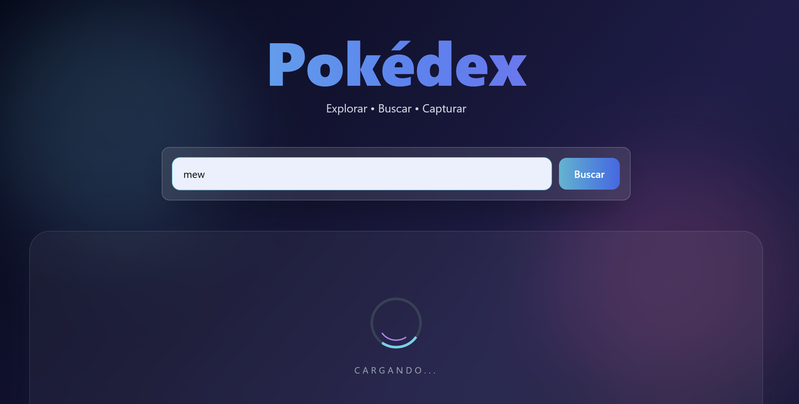
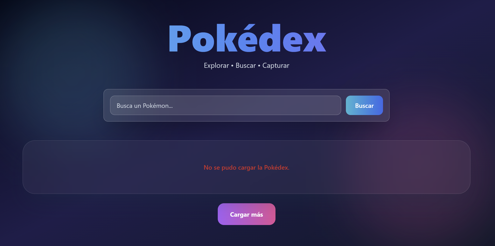

# Pokédex

Aplicación web desarrollada con **JavaScript**, **Tailwind CSS** y **PokeAPI** que permite buscar, visualizar y capturar Pokémon consumiendo una API REST mediante `fetch`, `async/await` y `Promise.all`.

## Características

* 🔍 Buscar Pokémon por nombre o número.
* 📦 Cargar Pokémon iniciales desde la API.
* ⚡ Capturar Pokémon y agregarlos a la Pokédex.
* 📊 Visualizar estadísticas (HP, ataque, defensa, etc.).
* 📄 Cargar más Pokémon mediante paginación (`limit` y `offset`).
* ⚠️ Manejo de errores y estados de carga.

## Cómo usarlo

1. Abre el sitio desplegado.
2. Escribe el nombre o número de un Pokémon.
3. Presiona **Buscar** o la tecla **Enter**.
4. Revisa sus estadísticas y pulsa **Capturar** para agregarlo a la Pokédex.
5. Usa **Cargar más** para explorar nuevos Pokémon.

## Tecnologías

* JavaScript ES6+
* Fetch API
* Async/Await
* Promise.all
* Try/Catch/Finally
* Tailwind CSS
* PokeAPI

## Uso de Promesas y Async/Await por Historia de Usuario

### HU1 – Cargar la Pokédex

Se utilizó `Promise.all()` para realizar múltiples peticiones a la PokeAPI de forma paralela y cargar los Pokémon iniciales de manera más eficiente.

### HU2 – Buscar Pokémon

La búsqueda se implementó con `async/await`, esperando la respuesta de la API antes de mostrar el resultado al usuario.

### HU3 – Capturar Pokémon

Después de obtener el Pokémon mediante una llamada asíncrona, se añadió a la Pokédex evitando duplicados mediante una validación sobre el arreglo local.

### HU4 – Mostrar estadísticas

Las estadísticas (HP, ataque, defensa, etc.) se obtienen directamente de la respuesta de la API y se representan mediante barras de progreso.

### HU5 – Cargar más Pokémon

Se implementó la paginación utilizando los parámetros `limit` y `offset` de la PokeAPI, realizando nuevamente varias peticiones en paralelo con `Promise.all()`.

### Manejo de errores

Se empleó `try/catch` para capturar errores de red y mostrar un mensaje amigable al usuario.

Cuando la API responde con un **404**, la aplicación muestra un estado de "Pokémon no encontrado", diferenciándolo de un error de conexión.

Además, se utilizó `finally` para garantizar que el indicador de carga desaparezca siempre, tanto en operaciones exitosas como fallidas.

## Capturas

### Estado de carga



```text
docs/images/loading.png
```

### Error de conexión



```text
docs/images/error.png
```

## Demo
🔗 [Ver en GitHub Pages](https://geffrerson7.github.io/pokedex/)