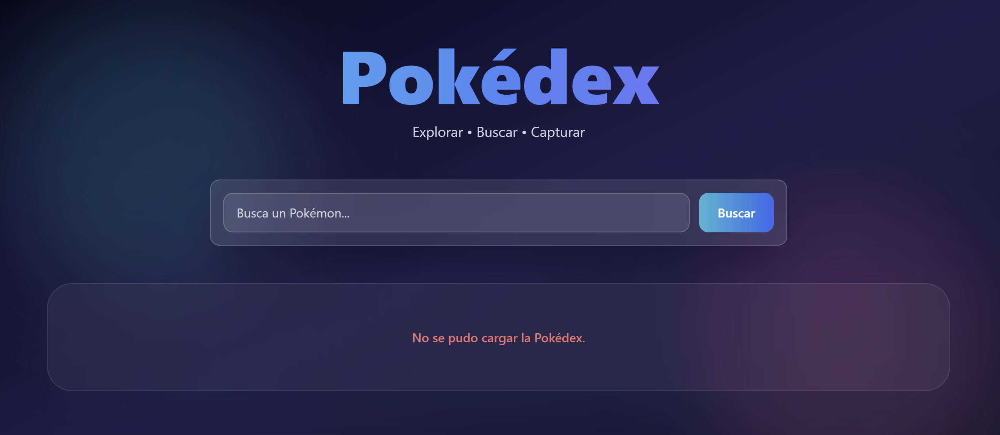

# Pokédex


Aplicación web desarrollada con **JavaScript**, **Tailwind CSS** y **PokeAPI** que permite buscar, visualizar y capturar Pokémon consumiendo una API REST mediante `fetch`, `async/await`, `Promise.all` y manejo de errores asíncronos.

---

# Tabla de contenidos

- Características
- Tecnologías
- Instalación
- Cómo usarlo
- Estructura del proyecto
- Historias de Usuario
- Uso de Promesas y Async/Await
- Manejo de errores
- Capturas
- Mejoras implementadas
- Mejoras futuras
- Demo
- Créditos

---

# Características

- 🔍 Buscar Pokémon por nombre o número.
- 📦 Cargar Pokémon iniciales desde la API.
- 📄 Cargar más Pokémon mediante paginación (`limit` y `offset`).
- 📊 Visualizar estadísticas base con barras de progreso.
- ⚡ Capturar Pokémon y agregarlos a la Pokédex.
- 🎨 Interfaz moderna con Tailwind CSS y Glassmorphism.
- ⚠️ Manejo de errores y estados de carga.
- 🔁 Botón **Reintentar** cuando ocurre un error de conexión.

---

# Tecnologías

- JavaScript ES6+
- Fetch API
- Async/Await
- Promise.all
- Try/Catch/Finally
- HTML
- Tailwind CSS
- CSS
- PokeAPI

---

# Instalación

Clona el repositorio:

```bash
git clone https://github.com/geffrerson7/pokedex.git
```

Entra al proyecto:

```bash
cd pokedex
```

Abre `index.html` en tu navegador o utiliza una extensión como **Live Server** en Visual Studio Code.

---

# Cómo usarlo

1. Abre el sitio desplegado.
2. Escribe el nombre o número de un Pokémon.
3. Presiona **Buscar** o la tecla **Enter**.
4. Revisa sus estadísticas.
5. Pulsa **Capturar** para agregarlo a la Pokédex.
6. Usa **Cargar más** para explorar nuevos Pokémon.

---

# Estructura del proyecto

```
pokedex/
│
├── css/
│   └── styles.css
│
├── docs/
│   └── images/
│
├── js/
│   └── app.js
│
├── index.html
└── README.md
```

---

# Historias de Usuario

## HU1 – Atrapar errores con `try/catch`

Cuando ocurre un problema de conexión, la aplicación muestra un mensaje claro sin dejar de funcionar.

## HU2 – Detectar Pokémon no encontrado

Cuando el usuario busca un Pokémon inexistente, se muestra un mensaje indicando exactamente cuál no fue encontrado.

## HU3 – Estado de carga con `finally`

Mientras la aplicación consulta la API se muestra un indicador de carga que desaparece siempre, independientemente del resultado.

## HU4 – Buscar Pokémon

Permite buscar Pokémon tanto por nombre como por número utilizando la PokeAPI.

## HU5 – Cargar más Pokémon

Implementa paginación utilizando los parámetros `limit` y `offset` para seguir explorando la Pokédex.

---

# Uso de Promesas y Async/Await

## Carga inicial

Se utilizó `Promise.all()` para realizar múltiples peticiones en paralelo y reducir el tiempo de carga inicial.

## Búsqueda

Las búsquedas utilizan `async/await` para simplificar el manejo de operaciones asíncronas.

## Captura

Después de obtener un Pokémon desde la API, se valida que no exista previamente antes de agregarlo a la Pokédex.

## Paginación

Cada clic sobre **Cargar más** obtiene un nuevo grupo de Pokémon mediante `Promise.all()` y los agrega sin duplicados.

---

# Manejo de errores

La aplicación distingue distintos escenarios:

- Error de conexión mediante `try/catch`.
- Estado de carga utilizando `finally`.
- Pokémon inexistente (`404`) tratado como un resultado vacío.
- Botón **Reintentar** para repetir la última búsqueda cuando ocurre un error de red.

---

# Capturas

## Estado de carga


```
docs/images/loading.png
```

## Error de conexión



```
docs/images/error.png
```

---

# Mejoras implementadas

- Glassmorphism.
- Gradientes dinámicos por tipo.
- Colores automáticos según el tipo del Pokémon.
- Hover con iluminación dinámica.
- Barras de estadísticas animadas.
- Diseño responsive.
- Animaciones optimizadas para mejorar el rendimiento.
- Botón Reintentar.
- Búsqueda por nombre o número.

---

# Mejoras futuras

- Filtrar por tipo.
- Ordenar Pokémon.
- Mostrar evoluciones.
- Agregar favoritos.
- Tema claro/oscuro.
- Modal con información completa.
- Búsqueda con autocompletado.

---

# Demo

🔗 https://geffrerson7.github.io/pokedex/

---
